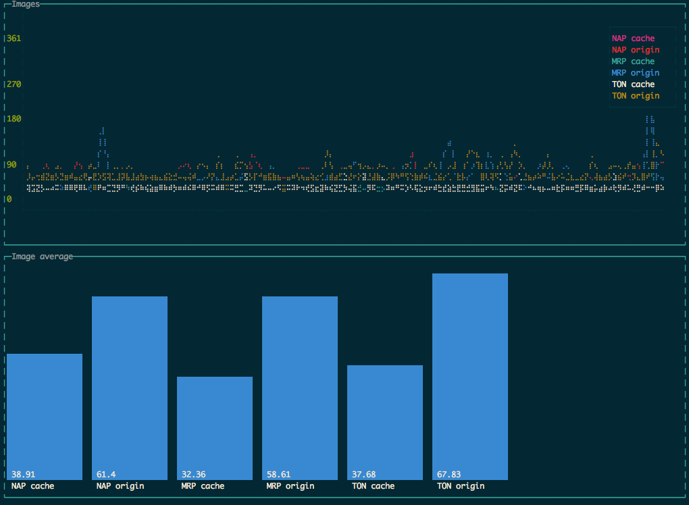

# Product image performance



Net-A-Porter are currently looking at dynamic image resizing service by Mr Porter and The Outnet. This project was to check the performance didn't degrade our customer experience.

Once the application has a bunch of PIDs (Product IDs) it will then make 10 requests to origin and the cdn. Each time it will collect how long the response took, generating an average.

Once complete it will save this data and display the results in terminal.

## Set up
```bash
  nvm use
  npm install
```

## Running
```bash
  npm start
```

### Graphing benchmarks

Each time you run a performance test it will save a benchmark inside the folder: `benchmarks`. If you want to graph an existing benchmark you can:

```bash
  BENCHMARK_FILENAME=2016-08-11_14-41-13.json npm start
```

### Configuration

Randomize PID list, default hits whats new pid list, this is more likely to be cached within resize service:
```bash
    RANDOM_PIDS=true npm start
```

Alter the number of PIDS (Product IDs):
```bash
    NUMBER_OF_PIDS=20 npm start
```

Load local PID list:
```bash
    NAP_LOCAL_PIDS=true npm start
```

You can string multiple local pid lists together:
```bash
    NAP_LOCAL_PIDS=true MRP_LOCAL_PIDS=true TON_LOCAL_PIDS=true npm start
```
If you want to update the lists they need to match the product API PID format:

```bash
curl http://lad-api.net-a-porter.com/NAP/GB/20/0/pids?visibility=visible&whatsNew=Now
```
Then saved in the folder: `pids`
